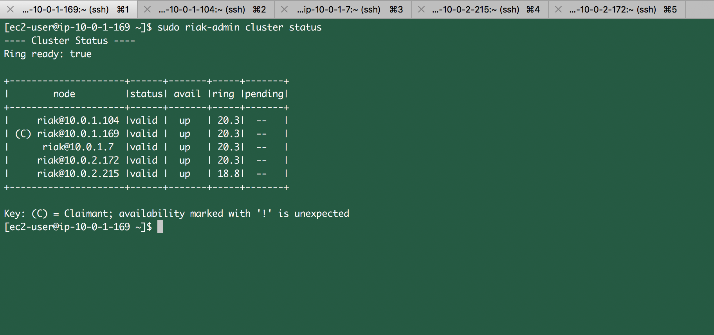

## Network Partitioning on the Dashboard Service of Book My Event App

### Choice of DB
RIAK DB

### Why?
RIAK is a CA system. A dashboard is a service which does not be consistent across the devices for the user, but it is very important for him to see data at every time which makes `RIAK` a very optimal choice. Its a `Key:Value` pair system.

### Last Write Wins
In a CA system there can be writes into multiple DB's of a cluster. During the conflict resolution the data which has a higher timestamp is written into it.


### SSH into Jumpbox
`ssh -i "cmpe281-nyu-aws-oregon.pem.pem" ec2-user@ec2-54-186-66-83.us-west-2.compute.amazonaws.com`

### SSH into our RIAK clusters through jumpbox
```
ssh -i "cmpe281-nyu-aws-oregon.pem" ec2-user@10.0.1.169
ssh -i "cmpe281-nyu-aws-oregon.pem" ec2-user@10.0.1.104
ssh -i "cmpe281-nyu-aws-oregon.pem" ec2-user@10.0.1.7
ssh -i "cmpe281-nyu-aws-oregon.pem" ec2-user@10.0.2.215
ssh -i "cmpe281-nyu-aws-oregon.pem" ec2-user@10.0.2.172
```


### Creating a RIAK Cluster

#### Log into each of the instance using ssh and run the command on each of the instance
```
sudo riak start
sudo riak ping
sudo riak-admin status
```

#### Initiate the cluster by running the below command into each instance
```
sudo riak-admin cluster join riak@10.0.1.169
```

#### Checking the status of the cluster
```
sudo riak-admin cluster status
```

#### Creating a bucket and activating it
```
sudo riak-admin bucket-type create <bucket_name>
sudo riak-admin bucket-type activate <bucket_name>
```

#### Checking the status of the RIAK cluster



### Status of RIAK Cluster


### Pinging into RIAK cluster for checking health
```
curl -X GET http://10.0.1.169:8098/ping
curl -X GET http://10.0.1.104:8098/ping
curl -X GET http://10.0.1.7:8098/ping
curl -X GET http://10.0.2.215:8098/ping
curl -X GET http://10.0.2.172:8098/ping
```


As we can see we are able to ping into all of our instance

### Checking the Dashboard service before the Partition of the service


As we can see our dashboard service is up and running

### Stopping one of the instance of the cluster


We have stopped one of the instance in the dashboard service to create partition. The IP of the instance which is down is `10.0.2.172`

### Pinging into RIAK cluster for checking health
```
curl -X GET http://10.0.1.169:8098/ping
curl -X GET http://10.0.1.104:8098/ping
curl -X GET http://10.0.1.7:8098/ping
curl -X GET http://10.0.2.215:8098/ping
curl -X GET http://10.0.2.172:8098/ping
```
As `10.0.2.172` is down we were not able to ping it.  `curl -X GET http://10.0.2.172:8098/ping` did not respond.


### Dashboard status after Stopping one of the instance


As we have stopped `10.0.2.172` but still we can still see dashboard service up and running.


### Health check of targets of  Newtork Load balancer


### Creating an event during Partition


Let us post an event during the partition

### Checking the event created on dashboard during Partition


After successful creation of event during the partition we can see the posted event on the dashboard of the user. So our service is up and running during the partition making it as a `fault tolerant` service.

### Checking the RIAK servers status during partition
```
curl -X GET http://10.0.1.169:8098/ping
curl -X GET http://10.0.1.104:8098/ping
curl -X GET http://10.0.1.7:8098/ping
curl -X GET http://10.0.2.215:8098/ping
curl -X GET http://10.0.2.172:8098/ping
```

Let us ping into each of the servers during the partition and check which of the servers are running.


Still `curl -X GET http://10.0.2.172:8098/ping` does not respond but still user able to interact with our service which makes it a `Fault Tolerant` system. 


### Reference
- [Network Partition](https://gerardnico.com/data/distributed/network_partition)
- [RIAK cluster](https://docs.riak.com/riak/kv/latest/using/running-a-cluster/index.html)


