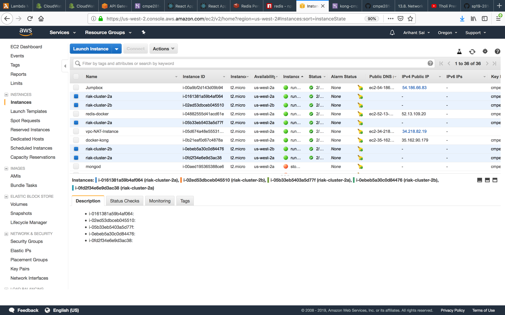
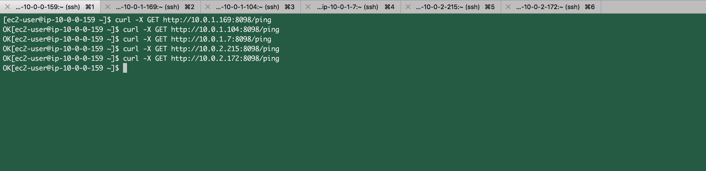
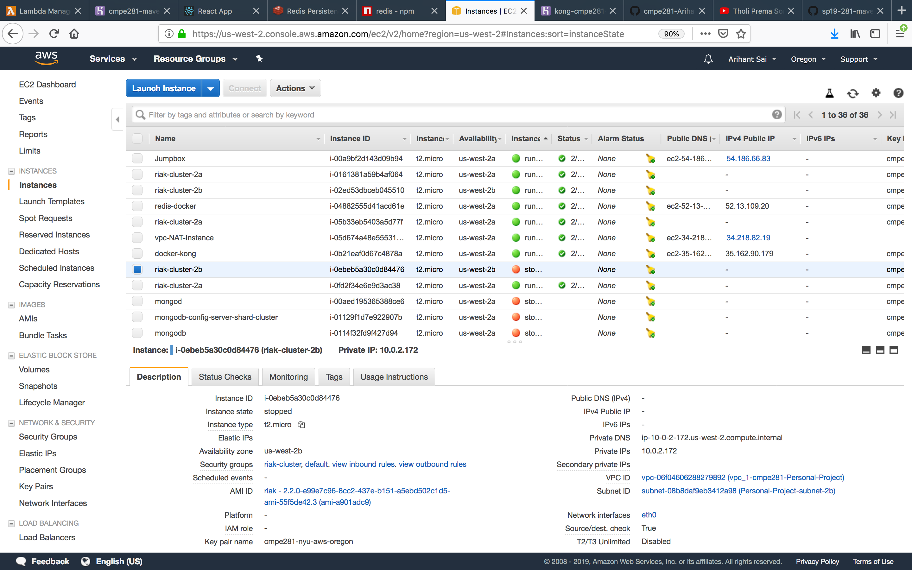
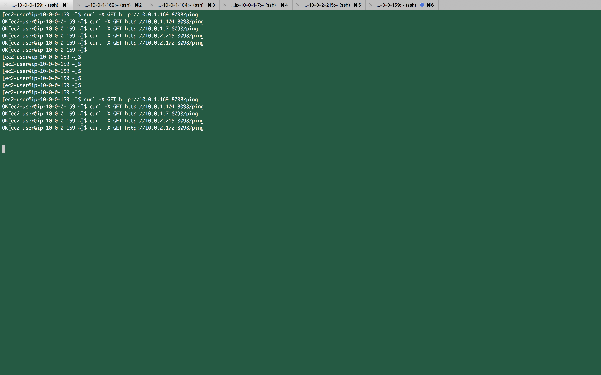
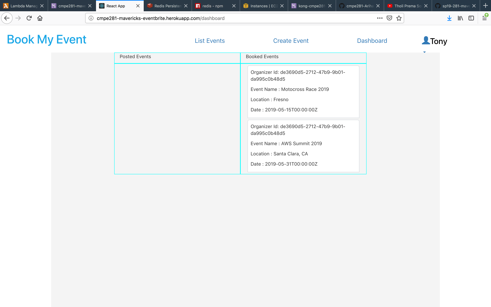
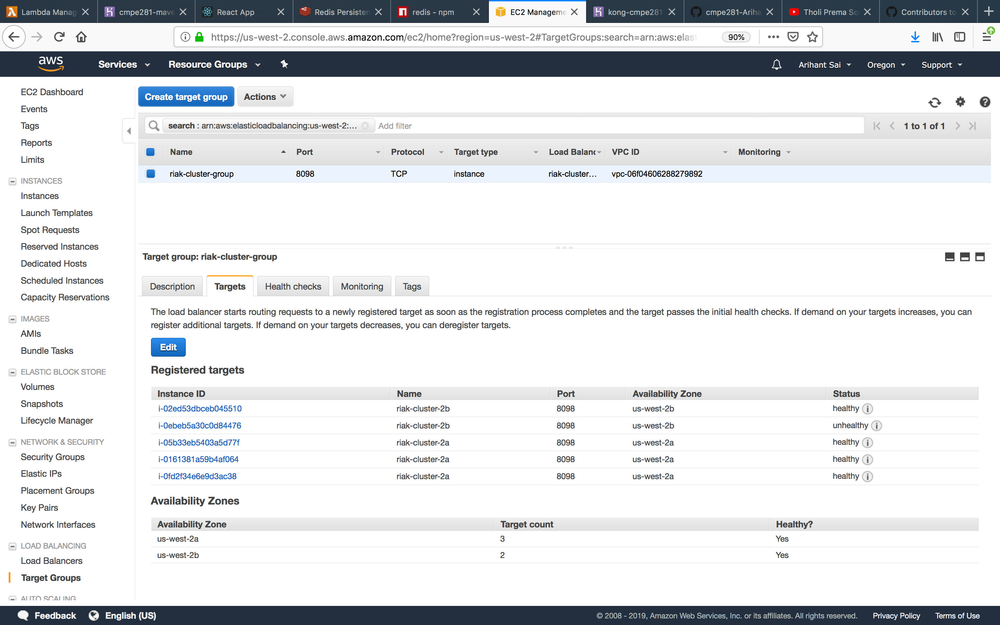
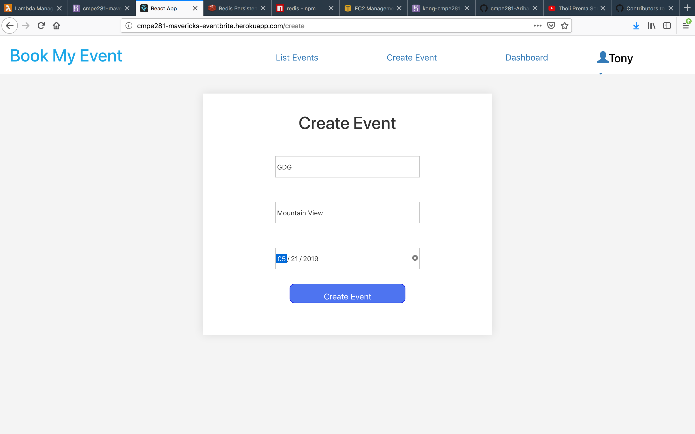
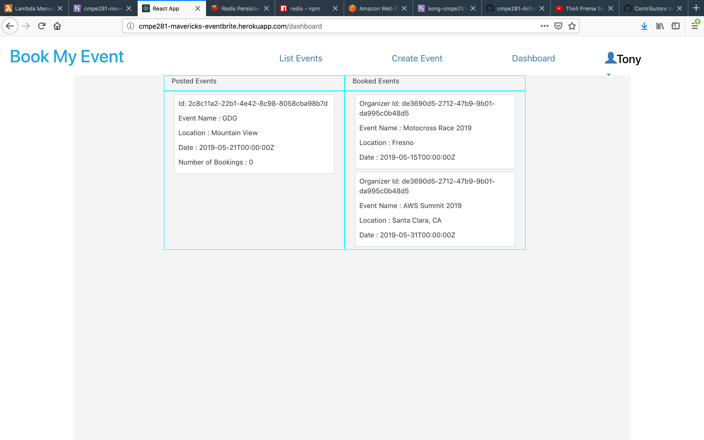
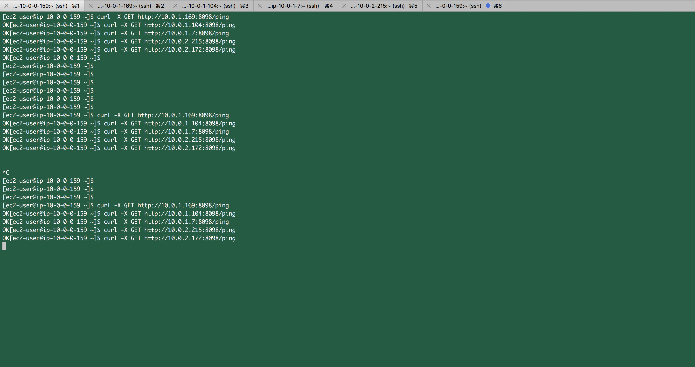

## Network Partitioning on the Dashboard Service of Book My Event App

### SSH into Jumpbox
`ssh -i "cmpe281-nyu-aws-oregon.pem.pem" ec2-user@ec2-54-186-66-83.us-west-2.compute.amazonaws.com`

### SSH into our RIAK clusters through jumpbox
```
ssh -i "cmpe281-nyu-aws-oregon.pem" ec2-user@10.0.1.169
ssh -i "cmpe281-nyu-aws-oregon.pem" ec2-user@10.0.1.104
ssh -i "cmpe281-nyu-aws-oregon.pem" ec2-user@10.0.1.7
ssh -i "cmpe281-nyu-aws-oregon.pem" ec2-user@10.0.2.215
ssh -i "cmpe281-nyu-aws-oregon.pem" ec2-user@10.0.2.172
```

Status of RIAK Cluster


Pinging into RIAK cluster for checking health
```
curl -X GET http://10.0.1.169:8098/ping
curl -X GET http://10.0.1.104:8098/ping
curl -X GET http://10.0.1.7:8098/ping
curl -X GET http://10.0.2.215:8098/ping
curl -X GET http://10.0.2.172:8098/ping
```


Dashboard service before Partition


Stopping one of the instance of the cluster


Pinging into RIAK cluster for checking health
```
curl -X GET http://10.0.1.169:8098/ping
curl -X GET http://10.0.1.104:8098/ping
curl -X GET http://10.0.1.7:8098/ping
curl -X GET http://10.0.2.215:8098/ping
curl -X GET http://10.0.2.172:8098/ping
```
One of the instance `http://10.0.2.172:8098/ping` did not respond.



Dashboard status after Stopping one of the instance



Health check of Newtork Load balancer


Creating an event during Partition


Checking the event created on dashboard during Partition


Checking the RIAK servers status during partition
```
curl -X GET http://10.0.1.169:8098/ping
curl -X GET http://10.0.1.104:8098/ping
curl -X GET http://10.0.1.7:8098/ping
curl -X GET http://10.0.2.215:8098/ping
curl -X GET http://10.0.2.172:8098/ping
```




